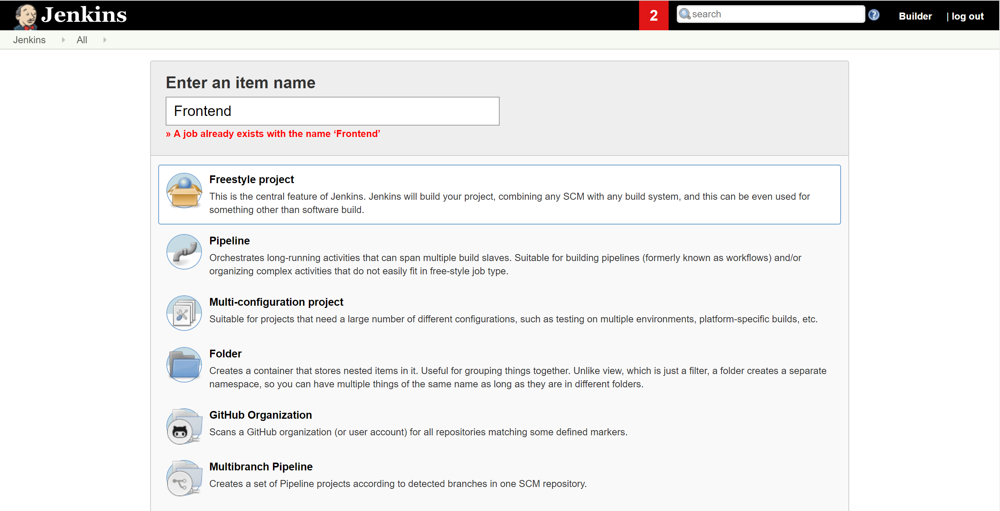
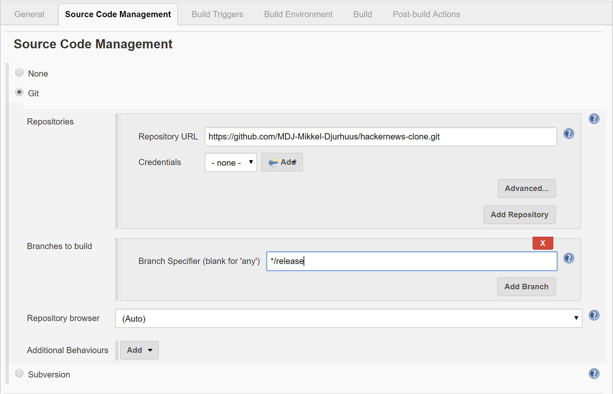
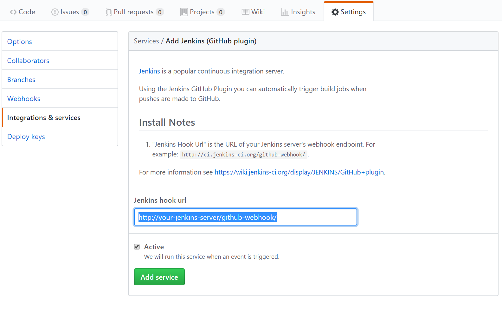
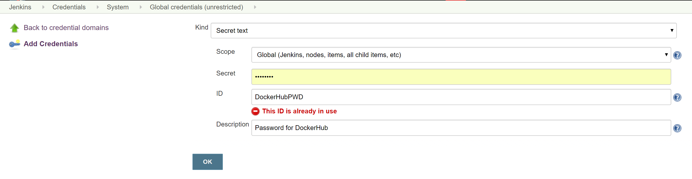
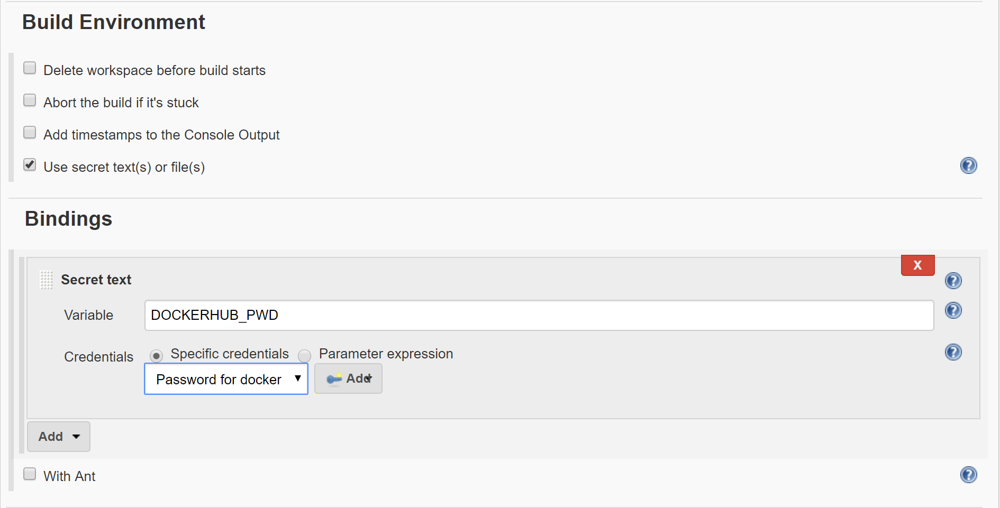
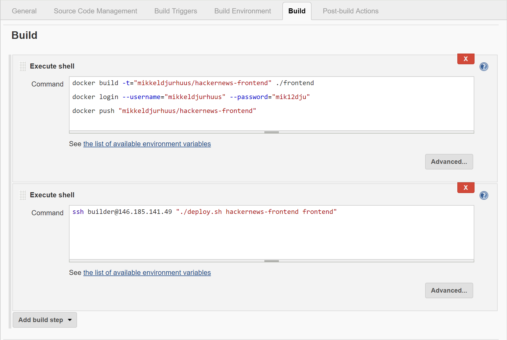

setup/install jenkins

Make a freestyle project



## Connect with Git

Go to the Setup source code management and insert information below



By now we still haven't told git about our jenkins server, so we need to configure a webhook. This is done logging into our github repository and navigate to settings => integrations & services. Here we add a new service by searching for "jenkins" and choosing the "Jenkins (Git plugin)".



We have now linked jenkins to our git

Now we need specify what should happen whenever git recieves a new commit to the release branch.







deployment script
```
#!/bin/bash
IMAGE_NAME=$1
SERVICE_NAME=$2
BUILD_NUMBER=$3

docker pull mikkeldjurhuus/${IMAGE_NAME}:${BUILD_NUMBER}
docker-compose up -d --no-deps --build ${SERVICE_NAME}
docker image prune -a
```
## Remote deployment!?
In the previous steps we log into our production server using SSH and execute a deployment script:  `ssh builder@146.185.141.49 "./deploy.sh"`. SSH, or secure shell, is an encrypted protocol used to administer and communicate with servers. While there are a few different ways of logging into an SSH server, in this guide, we'll focus on setting up SSH keys.
### Generate a Key Pair
To generate a new key pair, we login on our jenkins server and enter the following command in the terminal:
```
ssh-keygen
```
As we are logged into a user called builder, the output looks like the following:
```
ssh-keygen output
Generating public/private rsa key pair.
Enter file in which to save the key (/Users/builder/.ssh/id_rsa):
```
Hit return to accept this file name and path (or enter a new name).

This generates a private key, id_rsa, and a public key, id_rsa.pub, in the .ssh directory of the localuser (builder)'s  home directory. Remember that the private key should not be shared with anyone who should not have access to your servers!

### Copy the Public Key
After generating the SSH key pair, we need to copy the public key to our production server.

follwing the previous step, we can use the following command to print our public key (id_rsa.pub):
```
cat ~/.ssh/id_rsa.pub
```
This should print our public SSH key, which looks something like the following:
```
id_rsa.pub contents
ssh-rsa AAAAB3NzaC1yc2EAAAADAQABAAABAQDBGTO0tsVejssuaYR5R3Y/i73SppJAhme1dH7W2c47d4gOqB4izP0+fRLfvbz/tnXFz4iOP/H6eCV05hqUhF+KYRxt9Y8tVMrpDZR2l75o6+xSbUOMu6xN+uVF0T9XzKcxmzTmnV7Na5up3QM3DoSRYX/EP3utr2+zAqpJIfKPLdA74w7g56oYWI9blpnpzxkEd3edVJOivUkpZ4JoenWManvIaSdMTJXMy3MtlQhva+j9CgguyVbUkdzK9KKEuah+pFZvaugtebsU+bllPTB0nlXGIJk98Ie9ZtxuY3nCKneB+KjKiXrAvXUPCI9mWkYS/1rggpFmu3HbXBnWSUdf builder@jenkins-server
```
Select the public key, and copy it to your clipboard.

To enable the use of our SSH key to authenticate our jenkins server, we must add the public key to a file called authorized_keys inside a folder called .ssh at the home directory for our build user

On the server, as the root user, we enter the following command to switch to our build user (substitute your own user name):
```
su - builder
```
This will take us to the home directory for the user "builder".

Now we create the directory called .ssh and restrict its permissions with the following commands:
```
mkdir ~/.ssh
chmod 700 ~/.ssh
```
We will use nano to edit the authorized_keys file: (if the file doesn't exist it will automaticly be created)
```
nano ~/.ssh/authorized_keys
```
Now we insert the public key (which we copied earlier) by pasting it into the editor.

Hit CTRL-x to exit the file, then y to save the changes that you made, then ENTER to confirm the file name.

Now restrict the permissions of the authorized_keys file with this command:
```
chmod 600 ~/.ssh/authorized_keys
```
Now we have a public key installed, which means we now can SSH into our production server, from our jenkins server.
